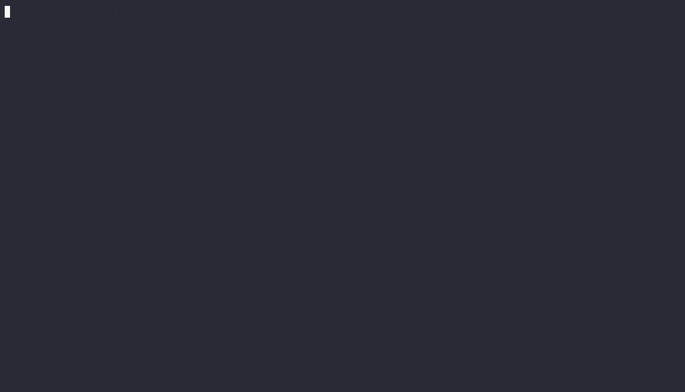

# Introduction

<h1 align="center">
   
  
   
  <h1 style="text-align: center;">Welcome to the <code> Free Panda's</code> docs!</h1>
   
</h1>

[Free Panda's]  is a web application that will allow users to comment on all of the content found on the Internet. Each comment will be shared by the entire YOWL user community.

This tool will make it possible to decentralize comments from social networks and to have a new vision of the web.

**Free Panda's** is free, and is accessible from the age of 13,**Free Panda's**   wants to conquer the target 13-35 years old.
    

[Free Panda's]: http://38.242.156.24:5174/login
